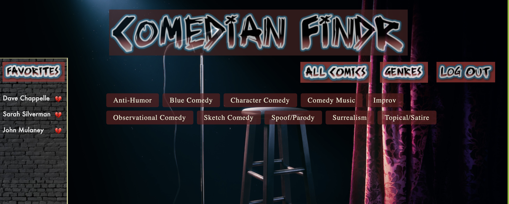

🎤 Welcome to ComedianFindr! 🎤

This single page app is a resource for comedy fans who want to find, follow and discover
professional comedians based on the genre they are most closely associated with. Users can 
log in, search for comics based on genre, "favorite" a comic, and leave a review for them.

Installation:
- Fork and clone this repository
- "bundle install" if necessary 
- Open ComedianFindr Backend
- Run "rails s" in the terminal 
- Open the ComedianFindr Frontend
- Run "open index.html" 

Navigating the app:
- First enter username and password
- You can see a list of "All Comics" by selecting the header button with the same name.
- See a list of all genres by selecting the "Genres" button.
- Select a specific genre that interests you to see all comics in our database associated with
  said genre.
- The comic detail card will provide an image, short bio, and video embed example of this 
  artist's work.
- You can favorite a comic by clicking the "🖤" at the top-right corner of that comic's detail 
  card. This comic will be added to the list of "Favorites" in the bar displayed on the left
  side of the window.
- To remove a favorite, click the "💔" next to a given comic's name in your "Favorties" bar.
- To leave a review, use the text area at the bottom of a comic's detail card and click submit.
  You will see your review displayed after submitting.
- To delete a review, click the "💣" next to the review.
- To log out, click the "Log Out" header button to be returned to the login page.

🎤 Created by Yevgeniy Valdman & Sam Hall 🎤